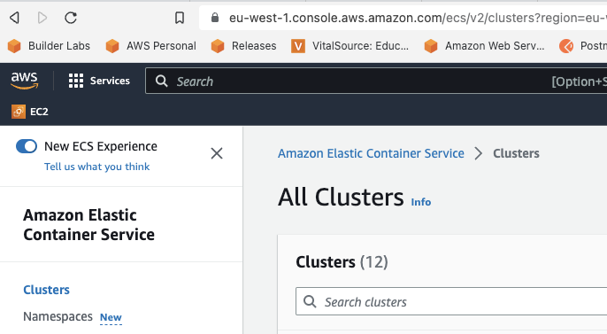

# Lab environment

* https://244530008913.signin.aws.amazon.com/console
* Username: student<n>

# GOAL 

The goal of this task is to gain hands-on experience with ELB and ECS, and to understand the benefits and tradeoffs of using this combination for scalable and resilient containerized workloads on AWS.

We will look into 

* Elastic Load Balancing (ELB) is an AWS service that automatically distributes incoming application traffic across multiple targets, such as EC2 instances, containers, and IP addresses, in one or more Availability Zones.
* Amazon Elastic Container Service (ECS) is a fully-managed container orchestration service that makes it easy to run, stop, and manage Docker containers on a cluster of EC2 instances.
* Using ECS with ELB can help ensure high availability, scalability, and fault tolerance for containerized applications running on AWS.
* The task at hand is to explore and test the use of ELB with ECS to distribute traffic to multiple containers running in a cluster.
* This will involve inspecting an existing  ECS cluster, and testing the load balancing behavior using various the K6 load test framework. 
* How to write- and run load tests using the K6 load test tool


## Log in to your AWS Cloud9  environment

Go to the AWS Management Console (https://244530008913.signin.aws.amazon.com/console)

* Start by entering your username, which is the part of your email before the '@' symbol, along 
  with the password provided during class.
* Click the "Sign In" button to proceed.
* Once logged in, you'll land on the AWS Management Console home page.
* Look to the top left corner for a navigation menu and click on the "Services" button.
* Within the services menu, find and select "Cloud9".
* This action will open the Cloud9 dashboard.
* Here, you'll see a list of the environments available to you.
* Choose your specific environment.
* Take some time to explore and experiment with Cloud9, getting familiar with its features and 
  interface.

## No auto save!

The number #1 problem for most students using Cloud9 is that they forget to explicitly save files  - as there is no auto save!

## Clone this repo

Clone this repository into your cloud 9 environment. Use the Terminal located on the bottom of the screen.

```text
git clone https://github.com/glennbechdevops/scaling-availability
```

## Inspect your load balancer and ECS cluster 

Important! IF prompted - Please make sure you have checked the "New ECS Experience" checkbox before following instructions. 



* Open your web browser and access the AWS Management Console.
* Use the search bar or the services menu to find and select "Elastic Container Service (ECS)".
* In the ECS dashboard, find and select your ECS cluster, identifiable by your name.
* Within the cluster, click on the service named after you. You'll be directed to its details page.
* On the service detail page, check the "Tasks" tab to ensure the task (container) status is "RUNNING".
* Navigate back to the "Health & Metrics" Tab
* Look for the "Load Balancing" section on this page. Under "Load Balancer Name", you'll find a clickable link to your Load Balancer saying "View Load Balancer ->"
* Click this link to view and confirm the load balancer's configuration, ensuring it's properly directing traffic to your ECS service.
* Test the setup by entering the load balancer's domain name in your browser's address bar.

## Run load tests against your own load balancer

* In your cloud9 environment, locate the file called ~/environment/scaling-availability/k6/simpletest.js
* Modify the statement ```http.get("");``` and insert your load balancer domain name, prefixed with ```http://``` example: http://glennbech-alb-12121212.eu-west-1.elb.amazonaws.com
* Run a simple load test against your ECS service 

Navigate to the folder with the load tests 

```shell
cd scaling-availability
cd k6
```

Run the load test to see that it's working

```shell
 docker run --rm -i grafana/k6 run --vus 10 --duration 30s - <simpletest.js
```
* vus are "virtual users" or concurrent threads 
* duration is as you might expect, how long the test will run 
* Spend some time looking through the report.
* Pay special attention to "http_req failed" to see that the test was successful 

## Extend the duration of the load test

Run another test for 5 minutes 
```shell
 docker run --rm -i grafana/k6 run --vus 10 --duration 5m - <simpletest.js
```

## Stop  a task while the test is running 

* From the ECS dashboard, select the cluster that your task is running on by clicking on its name.
* Under the "Tasks" tab, find the single running task and select the checkbox next to it.
* Click on the "Stop" Drop down located above the task list. chose "Stop selected"
* In the confirmation dialog box, review the details of the task and click the "Stop" button to stop the task.
* Wait for a few seconds for the task to stop, and then verify that its status has changed to "STOPPED". You can refresh the page to update the status.

Did you notice that the ECS service re-started a task during your test, after you stopped it? 
This is because the desired count is set to 1. 

## Observe that the load tests contain failures

Your report might look something like this 

```shell
     data_received..................: 1.5 MB 5.1 kB/s
     data_sent......................: 375 kB 1.2 kB/s
     http_req_blocked...............: avg=83.28µs min=3.81µs   med=5.08µs  max=25.76ms  p(90)=10.17µs  p(95)=11.95µs 
     http_req_connecting............: avg=19.33µs min=0s       med=0s      max=8.83ms   p(90)=0s       p(95)=0s      
     http_req_duration..............: avg=1.76ms  min=447.42µs med=1.75ms  max=15.4ms   p(90)=2.74ms   p(95)=3.04ms  
       { expected_response:true }...: avg=2.33ms  min=1.3ms    med=2.23ms  max=9.62ms   p(90)=2.94ms   p(95)=3.21ms  
     http_req_failed................: 45.10% ✓ 1353     ✗ 1647
     http_req_receiving.............: avg=40.79µs min=18.12µs  med=30.16µs max=433.33µs p(90)=67.57µs  p(95)=88.04µs 
     http_req_sending...............: avg=49.4µs  min=9.03µs   med=14.87µs max=933.9µs  p(90)=109.55µs p(95)=320.93µs
     http_req_tls_handshaking.......: avg=0s      min=0s       med=0s      max=0s       p(90)=0s       p(95)=0s      
     http_req_waiting...............: avg=1.67ms  min=405.66µs med=1.67ms  max=15.32ms  p(90)=2.61ms   p(95)=2.88ms  
     http_reqs......................: 3000   9.972239/s
     iteration_duration.............: avg=1s      min=1s       med=1s      max=1.02s    p(90)=1s       p(95)=1s      
     iterations.....................: 3000   9.972239/s
     vus............................: 10     min=10     max=10
     vus_max........................: 10     min=10     max=10
```

* Observe that the errors under ```http_req_failed```

## Increase the desired task count 

* From the ECS dashboard, select the cluster that your service is running on by clicking on its name.
* Under the "Services" tab, find the service that you want to update and click on its name to view its details.
* In the service detail page, click on the "Update Service" button to modify the service configuration.
* In the "Desired tasks" field, enter the desired number of tasks (2) that you want to run for the service. You can set this value between the minimum and maximum value specified in the service capacity settings.
* Oce you have made the desired changes, review the configuration details and click the "Update" button to save the changes.
* Wait for a few seconds for the service to update, and then verify that the desired number of tasks are running as expected. You can check the service status and the tasks' status in the ECS dashboard.

## Re-start load tests 

From your Cloud9 environment, run another test for 10 minutes
```shell
 docker run --rm -i grafana/k6 run --vus 10 --duration 10m - <simpletest.js
```

## Stop as single task to simulate a failure

By following the previous given instructions on how to stop a task, do exactly that. 
Make sure not to stop both of them!

Also notice that there will another task started very shortly after you stop one. This is because ECS tries to keep the 
kast count at your _desired_ level. 

## Observe that the load tests contain no/few failed requests


Your report might look something like this

```shell
     data_received..................: 2.0 MB 6.5 kB/s
     data_sent......................: 375 kB 1.2 kB/s
     http_req_blocked...............: avg=43.51µs min=3.75µs  med=5.55µs  max=11.56ms  p(90)=10.15µs p(95)=11.99µs 
     http_req_connecting............: avg=12.56µs min=0s      med=0s      max=4.06ms   p(90)=0s      p(95)=0s      
     http_req_duration..............: avg=2.29ms  min=1.05ms  med=1.94ms  max=122.79ms p(90)=2.87ms  p(95)=3.09ms  
       { expected_response:true }...: avg=2.29ms  min=1.05ms  med=1.94ms  max=122.79ms p(90)=2.87ms  p(95)=3.09ms  
     http_req_failed................: 0.00%  ✓ 0        ✗ 2998
     http_req_receiving.............: avg=46.73µs min=19.51µs med=36.91µs max=464.19µs p(90)=66.8µs  p(95)=93.84µs 
     http_req_sending...............: avg=34.94µs min=9.28µs  med=18.1µs  max=1.08ms   p(90)=41.97µs p(95)=171.21µs
     http_req_tls_handshaking.......: avg=0s      min=0s      med=0s      max=0s       p(90)=0s      p(95)=0s      
     http_req_waiting...............: avg=2.21ms  min=1ms     med=1.87ms  max=122.69ms p(90)=2.79ms  p(95)=3.02ms  
     http_reqs......................: 2998   9.963744/s
     iteration_duration.............: avg=1s      min=1s      med=1s      max=1.12s    p(90)=1s      p(95)=1s      
     iterations.....................: 2998   9.963744/s
     vus............................: 10     min=10     max=10
     vus_max........................: 10     min=10     max=10```
```

# Extra tasks 

* Look more into Ramp ups and how to use options https://k6.io/docs/get-started/running-k6/
* How much can you stress the application? What will break first? Cloud 9 or the app?
* Sjekk ut hvordan man kan integrere med Cloud løsningen her ; https://k6.io/docs/cloud/creating-and-running-a-test/cloud-tests-from-the-cli/

# Conclusion 

'* In this lab you saw how we can make a system robust and resilient to failures by implementing load balancing and automatic scaling 
* We also got a brief introduction to load testing with the K6 framework 
* We dug a bit under the hood of ECS and saw how the concepts of tasks and services work.
