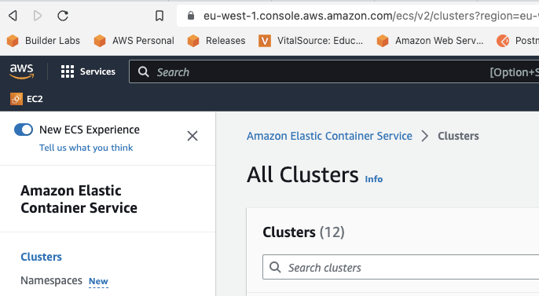

# LAB - RESILIENT ARCHITECTURE BASED ON AWS ECS AND CONTAINERS

* https://244530008913.signin.aws.amazon.com/console
* Username: seat#n

## GOAL 

In this exercise we will look into ... 

* Elastic Load Balancing (ELB) is an AWS service that automatically distributes incoming application traffic across multiple targets, such as virtual servers (EC2), docker containers, and IP addresses, across one or more Availability Zones.
* Amazon Elastic Container Service (ECS) is a fully-managed container orchestration service that makes it easy to run, stop, and manage Docker containers on a cluster of EC2 instances.
* Using ECS with ELB can help ensure high availability, scalability, and fault tolerance for containerized applications running on AWS.
* The task at hand is to explore and test the use of ELB with ECS to distribute traffic to multiple containers running in a cluster.
* This will involve inspecting an existing  ECS cluster, and testing the load balancing behavior using various the K6 load test framework. 
* How to write- and run load tests using the K6 load test tool

## Description of the infrastructure made for you in the lab 

This Terraform configuration sets up a serverless infrastructure on AWS to run a containerized application using Amazon ECS and Fargate. The core goal is to deploy a simple web application (`nginxdemos/hello` - a demo page that displays server and request information) that is publicly accessible through an Application Load Balancer (ALB).

The infrastructure uses an existing Virtual Private Cloud (VPC) and its subnets. The ECS cluster manages the containerized workload. A task definition specifies how the container is configured, including its compute resources, networking mode, and the image to deploy. The Fargate launch type handles server management automatically, allowing the container to run without provisioning or maintaining underlying compute instances.

Security groups control network access to the resources. The ALB accepts traffic over HTTP (port 80) and forwards it to the ECS service. The service communicates with the container running on port 80. The container's health is checked periodically to ensure it's working properly.

IAM roles and policies provide the necessary permissions for the ECS tasks, such as pulling container images and sending logs to AWS services. The load balancer distributes incoming requests across tasks and performs health checks to route traffic only to healthy instances.

This setup demonstrates a modern, serverless architecture for deploying a web application with scalability and minimal operational overhead. Resources are dynamically allocated, and the use of managed services like Fargate and ALB simplifies application deployment and maintenance.

---

### Learn More:
- [Amazon ECS and Fargate Overview](https://aws.amazon.com/ecs/)
- [Application Load Balancers](https://docs.aws.amazon.com/elasticloadbalancing/latest/application/introduction.html)
- [Terraform AWS Provider Documentation](https://registry.terraform.io/providers/hashicorp/aws/latest/docs)


# Part 1 Intro to Elastic Container Service. Load balancers, Services and tasks

## Set up your GitHub Codespaces environment

### Fork the Repository

* Navigate to this repository on GitHub
* Click the "Fork" button in the top-right corner
* Select your GitHub account as the destination
* Wait for GitHub to create your fork

### Launch Codespaces

* Navigate to **your forked repository** on GitHub
* Click the green "Code" button
* Select the "Codespaces" tab
* Click "Create codespace on main" (or select an existing codespace if you have one)
* Wait for the environment to build and start (this may take a minute or two the first time)
* You'll be presented with a VS Code interface in your browser

**Note:** GitHub provides 60 hours of free Codespaces usage per month for students and personal accounts.

### Access AWS Console

You'll need to access the AWS Management Console to view and manage ECS resources:

* Go to the AWS Management Console (https://244530008913.signin.aws.amazon.com/console)
* Start by entering your username and password given during class
* Click the "Sign In" button to proceed
* Once logged in, you'll land on the AWS Management Console home page
* Switch to the Ireland region (eu-west-1) - Look for a region name on the top menu

## Inspect your load balancer and ECS cluster 

Important! IF prompted - Please make sure you have checked the "New ECS Experience" checkbox before following instructions. 



* Open your web browser and access the AWS Management Console.
* Use the search bar or the services menu to find and select "Elastic Container Service (ECS)".
* In the ECS dashboard, find and select your ECS cluster, identifiable by your name.
* Within the cluster, click on the service named after you. You'll be directed to its details page.
* On the service detail page, check the "Tasks" tab to ensure the task (container) status is "RUNNING".
* Navigate back to the "Health & Metrics" Tab
* Look for the "Load balancer target health" section on this page. Click "View Load Balancer ->"
* Find the value for the "DNS name"
* Test the setup by entering the load balancer's DNS in your browser's address bar.

You should see a demo page showing server information, hostname, and request details. Notice the hostname - this will be useful later when we have multiple tasks running!

## Check robustnes! Stop  a task while the test is running 

In You will now see that the system is robust, and responds to system failure. If the one task that is running fails, AWS will launch 
a substitute. 

* Navigate back to the ECS cluster page (use the search bar to find "ECS" if needed)
* From the ECS dashboard, select the cluster with your name
* Under the "Tasks" tab, find the single running task and select the checkbox next to it.
* Click on the "Stop" Drop down item located on the right side above the running tasks. Select "Stop Selected"
* In the confirmation dialog box, review the details of the task and click the "Stop" button to stop the task.
* Wait for a few seconds for the task to stop, and then verify that its status has changed to "STOPPED". You can refresh the page to update the status.

Did you notice that the ECS service started a task after you stopped the other one? Can you find out why? 

This is pretty resiliant, right? But we'll make it better in part 2. 

# Part 2 - Load testing with K6 and multiple tasks

K6 is an open-source load testing tool designed for developers to test the performance and reliability of APIs, web applications, and microservices. It is lightweight, scriptable using JavaScript, and integrates easily into CI/CD pipelines, making it ideal for both local testing and automation.

## Navigate to the repository

The repository is already available in your Codespaces environment - no need to clone it separately since you launched Codespaces from your fork.

## Run a K6 load test against your own load balancer

* In your Codespaces VS Code editor, using the file explorer on the left side, locate the file called `k6/simpletest.js`
* Modify the statement ```http.get("");``` and insert your load balancer domain name, prefixed with ```http://``` example: http://glennbech-alb-12121212.eu-west-1.elb.amazonaws.com

Navigate to the k6 directory and run the load test:

```shell
cd k6
docker run --rm -i grafana/k6 run --vus 10 --duration 30s - <simpletest.js
```
* vus are "virtual users" or concurrent threads 
* duration is as you might expect, how long the test will run

When the test is finished you will see a report like this ; 


* Spend some time looking through the report.
* Pay special attention to "http_req failed" to see that the test was successful 

Some key metrics and example values 

- **`http_req_duration`**: Average request duration is `3.17ms` (90% complete within `4.12ms`), indicating good responsiveness.  
- **`http_reqs`**: 300 total requests at ~9.96 requests/second, reflecting test throughput.  
- **`http_req_failed`**: 0% failure rate, showing high reliability under load.  
- **`http_req_waiting`**: Average server processing time is `3.06ms` (90% complete within `4.01ms`).  

## Extend the duration of the load test

Run another test for 5 minutes, continue with the exercise while this load test is running.
```shell
docker run --rm -i grafana/k6 run --vus 10 --duration 5m - <simpletest.js
```

## Stop a task

Using the previous description, try  to stop  a task

## Observe that the load tests contain failures! :-(

Your report might look something like this 

```shell
     data_received..................: 1.5 MB 5.1 kB/s
     data_sent......................: 375 kB 1.2 kB/s
     http_req_blocked...............: avg=83.28µs min=3.81µs   med=5.08µs  max=25.76ms  p(90)=10.17µs  p(95)=11.95µs 
     http_req_connecting............: avg=19.33µs min=0s       med=0s      max=8.83ms   p(90)=0s       p(95)=0s      
     http_req_duration..............: avg=1.76ms  min=447.42µs med=1.75ms  max=15.4ms   p(90)=2.74ms   p(95)=3.04ms  
       { expected_response:true }...: avg=2.33ms  min=1.3ms    med=2.23ms  max=9.62ms   p(90)=2.94ms   p(95)=3.21ms  
     http_req_failed................: 45.10% ✓ 1353     ✗ 1647
     http_req_receiving.............: avg=40.79µs min=18.12µs  med=30.16µs max=433.33µs p(90)=67.57µs  p(95)=88.04µs 
     http_req_sending...............: avg=49.4µs  min=9.03µs   med=14.87µs max=933.9µs  p(90)=109.55µs p(95)=320.93µs
     http_req_tls_handshaking.......: avg=0s      min=0s       med=0s      max=0s       p(90)=0s       p(95)=0s      
     http_req_waiting...............: avg=1.67ms  min=405.66µs med=1.67ms  max=15.32ms  p(90)=2.61ms   p(95)=2.88ms  
     http_reqs......................: 3000   9.972239/s
     iteration_duration.............: avg=1s      min=1s       med=1s      max=1.02s    p(90)=1s       p(95)=1s      
     iterations.....................: 3000   9.972239/s
     vus............................: 10     min=10     max=10
     vus_max........................: 10     min=10     max=10
```

* Observe that the errors under ```http_req_failed```

## Increase the desired task count 

* From the ECS dashboard, select the cluster with your name. Click on its name.
* Under the "Services" tab, find the service with your name, click on its name to view its details.
* In the service detail page, click on the "Update Service" button to modify the service configuration.
* In the "Desired tasks" field, change the value to 2.
* Once you have made the desired changes, review the configuration details and click the "Update" button to save the changes.
* Wait for a few seconds for the service to update, and then verify that the desired number of tasks are running as expected. You can check the service status and the tasks' status in the ECS dashboard.

## Re-start load tests

From your Codespaces terminal, run another test for 5 minutes:
```shell
docker run --rm -i grafana/k6 run --vus 10 --duration 5m - <simpletest.js
```

## Stop as single task to simulate a failure

By following the previous given instructions on how to stop a task, do exactly that. 
Make sure not to stop both of them!

Also notice that there will another task started very shortly after you stop one. This is because ECS tries to keep the 
task count at your _desired_ level. 

## Observe that the load tests contain no/few failed requests


Your report might look something like this

```shell
     data_received..................: 2.0 MB 6.5 kB/s
     data_sent......................: 375 kB 1.2 kB/s
     http_req_blocked...............: avg=43.51µs min=3.75µs  med=5.55µs  max=11.56ms  p(90)=10.15µs p(95)=11.99µs 
     http_req_connecting............: avg=12.56µs min=0s      med=0s      max=4.06ms   p(90)=0s      p(95)=0s      
     http_req_duration..............: avg=2.29ms  min=1.05ms  med=1.94ms  max=122.79ms p(90)=2.87ms  p(95)=3.09ms  
       { expected_response:true }...: avg=2.29ms  min=1.05ms  med=1.94ms  max=122.79ms p(90)=2.87ms  p(95)=3.09ms  
     http_req_failed................: 0.00%  ✓ 0        ✗ 2998
     http_req_receiving.............: avg=46.73µs min=19.51µs med=36.91µs max=464.19µs p(90)=66.8µs  p(95)=93.84µs 
     http_req_sending...............: avg=34.94µs min=9.28µs  med=18.1µs  max=1.08ms   p(90)=41.97µs p(95)=171.21µs
     http_req_tls_handshaking.......: avg=0s      min=0s      med=0s      max=0s       p(90)=0s      p(95)=0s      
     http_req_waiting...............: avg=2.21ms  min=1ms     med=1.87ms  max=122.69ms p(90)=2.79ms  p(95)=3.02ms  
     http_reqs......................: 2998   9.963744/s
     iteration_duration.............: avg=1s      min=1s      med=1s      max=1.12s    p(90)=1s      p(95)=1s      
     iterations.....................: 2998   9.963744/s
     vus............................: 10     min=10     max=10
     vus_max........................: 10     min=10     max=10```
```

# Part 3 - Optional: Configure Auto Scaling

So far you've been manually changing the desired task count. Now let's configure automatic scaling based on traffic load.

## Understanding Target Tracking Auto Scaling

**Target tracking** is an auto scaling strategy where AWS automatically adjusts the number of tasks to keep a specific metric at a target value. If the metric goes above the target, AWS adds more tasks. If it drops below, AWS removes tasks.

**Why use ALB Request Count instead of CPU or Memory?**

This demo application is a simple static page served by nginx. Even under heavy traffic, it uses very little CPU and memory - nginx is extremely efficient at serving static content. If we used CPU or memory as our scaling metric, we'd never trigger auto scaling because those metrics would stay low even when the system is overloaded with requests.

Instead, we use **ALB Request Count Per Target** - this metric tracks how many requests each task is handling. This gives us a much better indicator of actual load for a static web application.

## Set up Auto Scaling in the AWS Console

* Navigate to your ECS cluster in the AWS Console
* Click on your service name
* Click the "Auto Scaling" tab
* Check the box "Use service auto scaling to adjust your service's desired task count"
* Set the capacity settings:
  - **Minimum number of tasks**: 1
  - **Maximum number of tasks**: 4
* Click "Update"

## Add a Scaling Policy

* In the same "Auto Scaling" tab, scroll down to "Scaling policies"
* Click "Create scaling policy"
* Configure the policy:
  - **Policy name**: `target-tracking-requests`
  - **Policy type**: Target tracking
  - **ECS service metric**: `ALBRequestCountPerTarget`
  - **Target value**: 500 (this means 500 requests per target per minute)
  - **Scale-out cooldown**: 60 seconds
  - **Scale-in cooldown**: 60 seconds

* Click "Create"

## Test Auto Scaling with Load

Now run a longer, more intense load test to trigger auto scaling:

```shell
docker run --rm -i grafana/k6 run --vus 50 --duration 10m - <simpletest.js
```

While the test is running:
* Watch the "Auto Scaling" tab in your ECS service
* You should see the "Desired tasks" count increase automatically as load builds up
* New tasks will be launched automatically
* After the test completes, watch tasks scale back down after the cooldown period

## Questions to Consider

* How long did it take for new tasks to start after load increased?
* Did the system scale enough to handle the load without errors?
* What happens to response times during scale-out events?
* Try adjusting the target value - what happens if you set it to 250 or 1000 instead?
* What would happen if you increased max tasks to 10?

# Extra tasks

* Look more into Ramp ups and how to use options https://k6.io/docs/get-started/running-k6/
* See if you can break the system by reducing the capacity of containers
* How much can you stress the application? What will break first? Codespaces or the app?
* Check out how to integrate with K6 Cloud for more advanced load testing: https://k6.io/docs/cloud/creating-and-running-a-test/cloud-tests-from-the-cli/
* Try different auto scaling metrics like CPU utilization - what happens?

# Conclusion

* In this lab you saw how we can make a system robust and resilient to failures by implementing load balancing and automatic scaling 
* We also got a brief introduction to load testing with the K6 framework 
* We dug a bit under the hood of ECS and saw how the concepts of tasks and services work.
